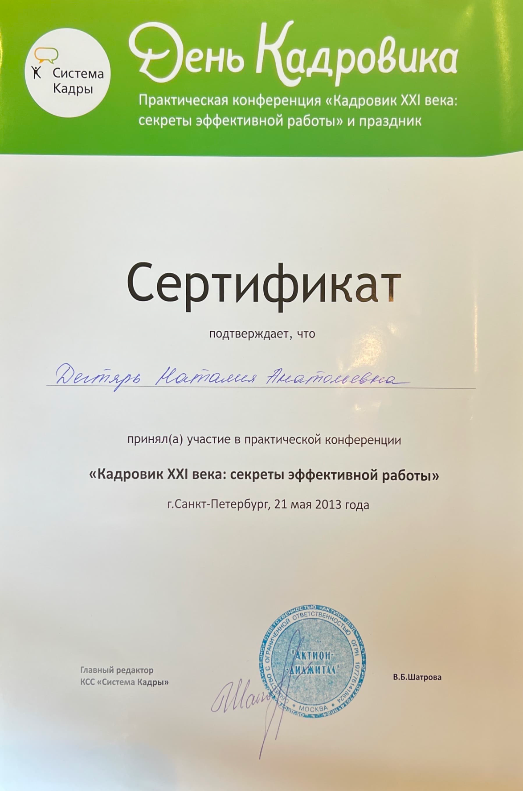
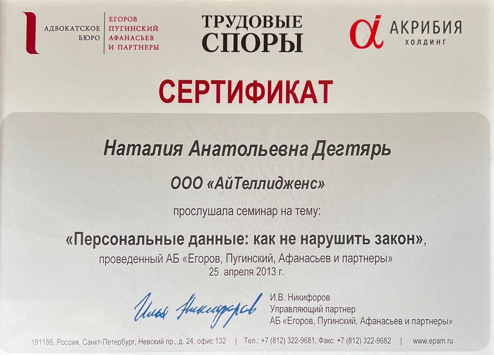
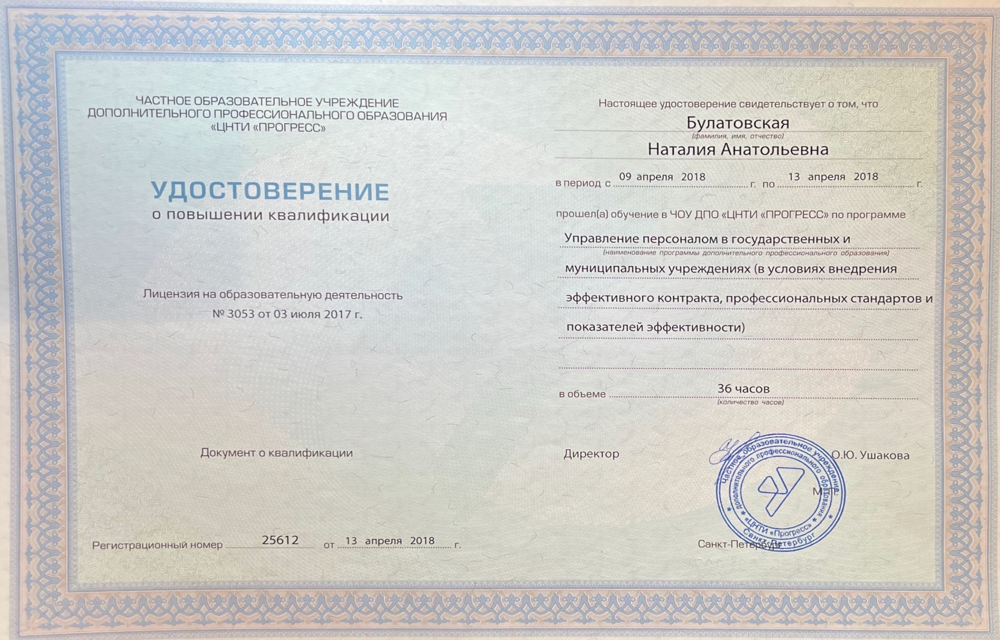
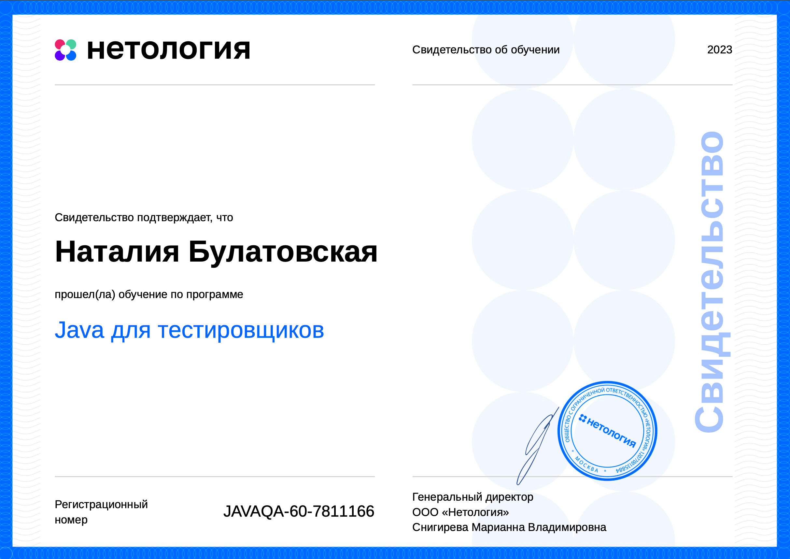

# Булатовская Наталия Анатольевна

*22.11.1989*

*Санкт-Петербург*

## Образование:

*Санкт-Петербургский государственный университет Низкотемпературных и Пищевых Технологий* 

Высшее профессиональное образование

Экономика и экологический менеджмент

Антикризисное управление

2011 г.

***Повышение квалификации***
1. Управление кадрами на предприятии (профессиональная переподготовка), 2012г.
2. Кадровые изменения, 2012г.

1. Охрана труда работников организаций, 2012г.

1. Основы электробезопасности, 2012г.

1. Основы пожарной безопасности, 2013г.

1. Все о прохождении инспекционной проверки по труду. Судебная практика, 2013г.
   
1. Кадровик XXI века: секреты эффективной работы, 2013г.

1. Кадровые изменения, 2013г.

1. Персональные данные: как не нарушить закон, 2013г.

1.   Подготовительные курсы по русскому языку, истории и обществознанию в РГПУ им А.И. Герцена, 2014г.

1.  Кадровая работа: как учесть свежие изменения законодательства, 2014г.

1.   Антикоррупционная деятельность в государственных учреждениях, 2015г.

1.  Воинский учет и мобилизационная подготовка в государственных учреждениях, 2015г.

1.  Прохождение оценки квалификации и включение в профессиональный реестр, 2016г.

1.  Единая система электронного документооборота и делопроизводства исполнительных органах государственной власти Санкт-Петербурга, 2016г.

1.  КонсультантПлюс, 2016г.

1.   Новейшие изменения в работе с персональными данными, 2017г.

1.   Участие в физкультурно-спортивном комплексе "ГТО", 2017г.

1.  Награждение Грамотой СПб ГКУ "Централизованная бухгалтерия Василеостровского района", 2017г.

1.   Внедрение профессиональных стандартов в государственных учреждениях, 2018г.

1.   Мобилизационная подготовка в организациях, 2018г.

1.    Ручное тестирование веб-приложений, 2023г.

1.  Git - система контроля версий, 2023г.

1.  Java для тестировщиков, 2023г.

1.  Автоматизированное тестирование, 2023г.

26. JavaScript для тестировщиков, 2023г.

1.  Автоматизация тестирования веб-интерфейсов, 2023г.

28. Тестирование мобильных приложений, 2023г.

29. Тестирование производительности, 2024г.

30. Тестирование безопасности, 2024г.

## Общий стаж работы:
Более 10 лет. С 2019г. по 2022г. находилась в отпуске по уходу за ребенком.